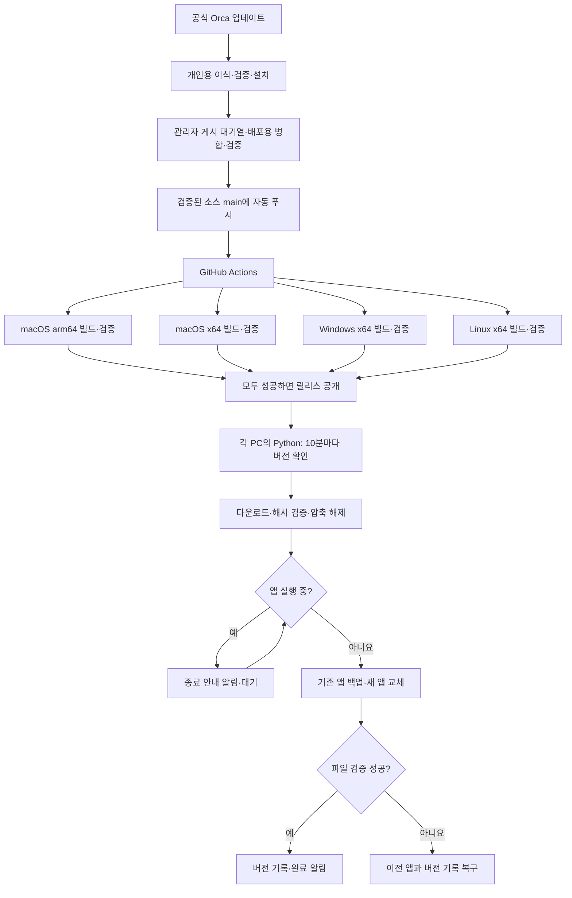

# 배포와 업데이트 구조

관리자의 GitHub 소스가 배포 기준입니다. 사용자 PC에는 앱과 별도 Python 업데이터가 설치됩니다. Python은 실행 파일 안에 포함되며 OS의 예약 실행 기능이 이를 실행합니다.

## 같은 소스로 다른 실행 파일 만들기

저장소는 하나지만 네이티브 라이브러리와 실행 파일은 OS·CPU마다 다릅니다. 각 GitHub 러너에서 별도로 빌드하며, 설치 ZIP에는 해당 환경의 앱과 Python 실행 파일만 넣습니다. 사용자 PC에서 전체 소스를 다시 컴파일하지 않습니다.

앱 내부 실행 파일 이름은 CLI 호환성을 위해 Orca로 유지합니다. 앱 식별자, 바로가기, 사용자 데이터 경로는 분리합니다. 현황 패널은 `src/renderer/src/components/orchestration-status/`와 관련 화면 연결부에 있습니다.

## Python 실행 순서

`updater/platforms.py`가 OS별 관리 경로, 예약 실행, 바로가기, 알림을 처리합니다. 예약 작업은 1분마다 `OrcaCustomBootstrap tick`을 실행하며, `last-check.json`으로 GitHub 조회를 10분에 한 번으로 제한합니다. 설치 대기 중에는 앱 종료 여부만 확인합니다.

고정된 부트스트랩은 `current.json`에 기록된 버전별 Python 실행 파일로 위임합니다. Windows에서 실행 중인 업데이터를 덮어쓰지 않기 위한 구조입니다. 새 업데이터도 앱과 함께 내려받아 버전별 위치에 둡니다.

`updater/network.py`는 저장소와 버전이 정확히 일치하는 GitHub URL만 허용하고 HTTPS로 내려받습니다. `release.json`의 모든 플랫폼 파일명·크기·SHA256을 실제 공개 파일 목록과 비교합니다. 다운로드 손상을 탐지하지만 저장소 계정 자체의 침해까지 방어하는 별도 서명 체계는 아닙니다.

`updater/policy.py`는 압축 경로 탈출·외부 심볼릭 링크·비정상 파일 형식을 거부하고 앱의 파일 해시와 링크 대상을 검증합니다. `updater/install.py`는 실행 중인 앱을 확인하고 같은 파일시스템에서 디렉터리를 교체합니다. GUI 종료 후 남는 정상적인 Orca 터미널 데몬은 구분하며 강제 종료하지 않습니다.

교체 전 `install-journal.json`에 새 버전과 이전 버전 기록을 저장합니다. 중단되면 다음 실행에서 파일을 확인해 설치를 확정하거나 이전 앱으로 복구합니다. 검증 실패에서는 앱과 버전 기록을 함께 되돌립니다. 디스크 고장 등으로 복구 기록도 쓰지 못하면 오류로 보고합니다.

## 빌드·공개 조건

`build.py`는 기존 Orca 빌드·패키징 검증을 유지하고 Python 실행 파일을 추가합니다. 앱은 tar.gz로 묶어 macOS 프레임워크의 심볼릭 링크와 실행 권한을 보존합니다. 외부 ZIP에는 payload, 파일 목록, 설치 메타데이터, Python 실행 파일, 설치 시작 파일을 넣습니다.

네 가지 빌드가 성공해야 `assemble_release.py`가 전체 해시를 검증하고 최종 메타데이터를 만듭니다. 모든 파일을 초안 릴리스에 올린 뒤 공개하며, 클라이언트는 초안·프리릴리스를 설치하지 않습니다. 빌드 하나가 실패하면 기존 공개 버전을 유지합니다.

## 운영 범위

원본 Orca 변경을 통합하는 개인용 업데이터의 설치 완료 이벤트를 [관리자 게시 프로그램](maintainer/README.md)이 받아 배포용 병합·검증·GitHub 푸시·릴리스 확인까지 자동으로 수행합니다. 관리자의 Mac에만 별도 예약 작업으로 설치됩니다. 사용자 PC에서 AI가 소스를 수정하거나 충돌을 해결하지 않습니다. 사용자의 로그인·프로젝트·설정과 관리자의 로컬 자동화 기록은 공개 배포물에 포함하지 않습니다.
